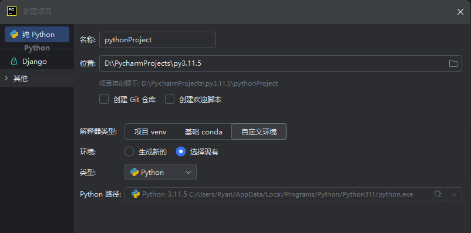

#### 安装 python

- 检查安装是否成功
  1.  win+R => cmd
  2.  输入 python => exit()
  3.  pip -V

#### 安装 PyCharm Community Edition 社区版免费



- 创建项目
  - 选择自定义环境
  - 选择现有
  - 选择自己电脑的 python `C:\Users\Daisy\AppData\Local\Programs\Python\Python311\python.exe`

#### VSCode

#### 注释

```python
# 注释分为两种，单行和多行
# 单行注释可以使用快捷键 Ctrl /
print('hello world')
"""
这是三队双引号组成的多行注释
可以换行，不会执行
"""
'''
这是三对单引号组成的注释，不会执行
'''
print('hello python')
print('hello ')

```

#### 变量

```py
# 需求 1, 定义一个变量 保存你的名字
name = "小明"   # 简单认为 变量 name 中保存了 数据 "小明"

# 需求 2, 使用变量 打印你的名字
print(name)   # 小明, 变量中存储的数据
# print('name')   # 输出引号中的内容

# 需求 3, 定义一个变量 保存你的年龄 并打印
age = 18
print(age)

# 性别
sex = '男'

# 身高
height = 170.1
print(sex, height)

age = 20
print(age)

```

#### 数据类型

```py
# int 整型  整数
age = 18
print(type(age))   # <class 'int'>

# float 浮点型  小数
height = 1.71
print(type(height))  # <class 'float'>

# bool 类型,True(真) 和 False(假), 都是关键字
# is_men = True
is_men = False
print(type(is_men))   # <class 'bool'>

# 字符串 str, 使用 引号引起来的就是字符串
name = 'tom'
print(type(name))

num = '20'
print(type(num))   # <class 'str'>

```

#### 控制台输入

```py
# 需求, 从键盘录入你的姓名
name = input('请输入你的姓名:')

print(type(name), name)  # 打印类型和变量的值

```

#### 数据类型转换

```py
age = input('请输入你的年龄:')

print(type(age), age)   # <class 'str'> 18

# 需求,将字符串的 18 转换为 int 类型的 18
new_age = int(age)  # 数据类型转换不会改变 age 的类型, 生成一个新的数据保存到 new_age
print(type(age), age)   # <class 'str'> 18
print(type(new_age), new_age)  # <class 'int'> 18

```

#### 字符串拼接

```py
name = '小明'
age = 18
sex = '男'

# 我的名字是 xx, 年龄 xx 岁, 性别为 xx.
print('我的名字是 ' + name + ', 年龄 ' + str(age) + ' 岁, 性别为 ' + sex + '.')
print('我的名字是 {}, 年龄 {} 岁, 性别为 {}.'.format(name, age, sex))
print(f'我的名字是 {name}, 年龄 {age} 岁, 性别为 {sex}.') # 推荐这个

```

#### 转义字符

```py
print('hello world', end=' ')
print('hello\nworld')
print('hello python')
print('hello\tpython')
```
