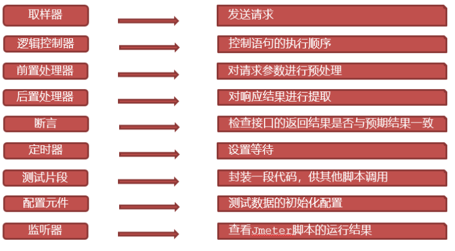
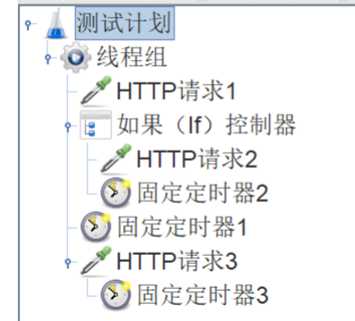
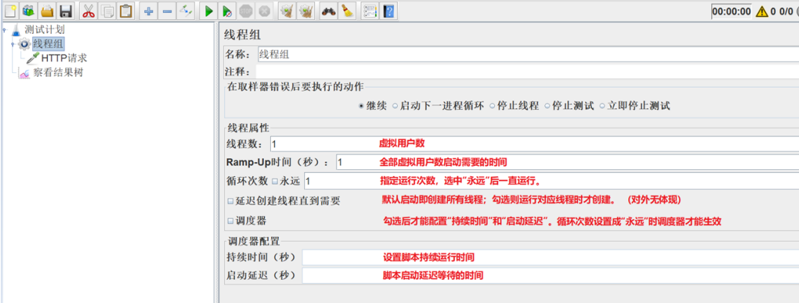
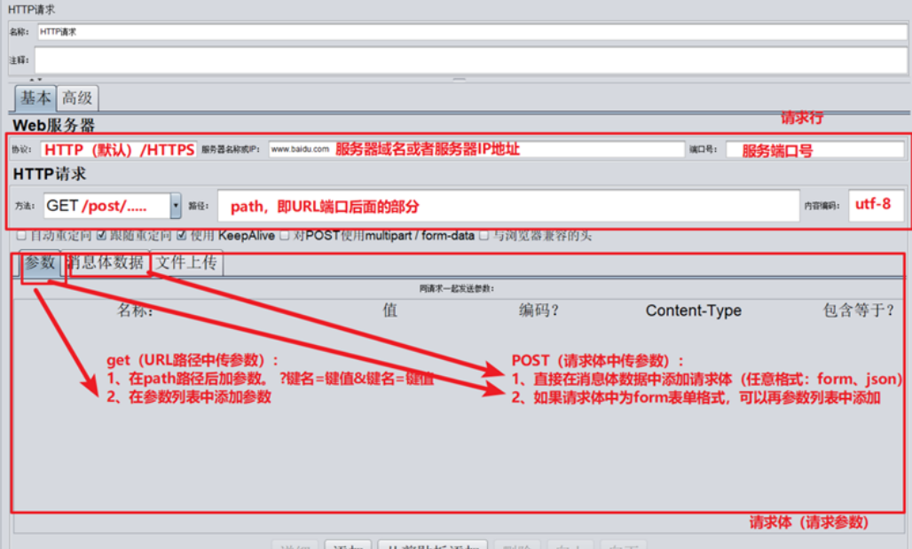
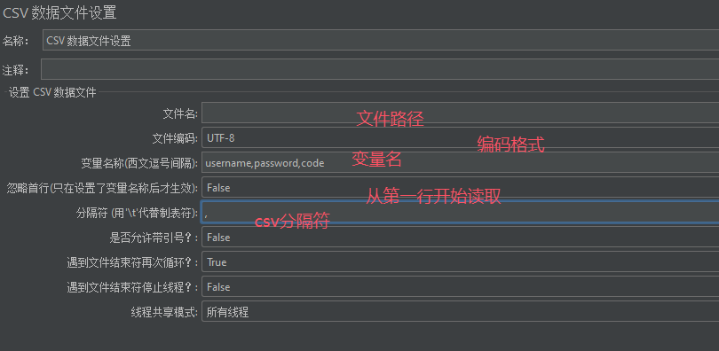
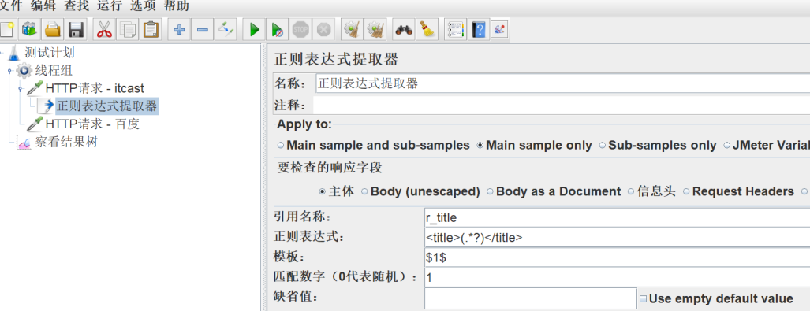
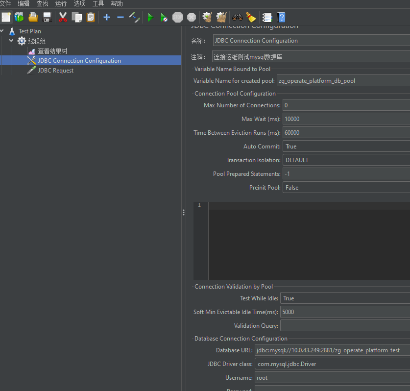
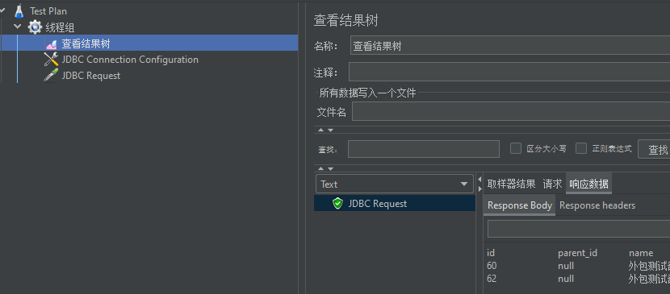

### JMeter

#### JMeter 环境安装 （具体 DeepSeek）

1. 安装 JDK
   1. 官网下载：http://www.oracle.com/
   2. 配置环境变量
   3. 校验 cmd -》 java -version
2. 安装 JMeter
   1. 官网下载地址:http://jmeter.apache.org/download_jmeter.cgi **Jmeter 版本与 JDK 版本匹配**
   2. 配置环境变量
   3. 校验
      1. 双击 jmeter.bat 打开
      2. windows 目录行 输入 cmd -》java -jar ApacheJMeter.jar
3. JMeter 目录

   1. lib 目录 存放 JMeter 依赖的 jar 包和用户扩展所依赖的 jar 包

4. 汉化
   1. 启动 JMeter -> 选择菜单‘Options’ -> Choose Language->Chinese (Simplified)
   2. 第二种： 找到 jMeter 安装目录下的 bin 目录 -》 打开 jmeter.properties 文件，把第 37 行修改为“language=zh_CN” -》 重启 JMeter
5. 修改主题： 选项 -》 外观 -》 主题

#### JMeter 元件（比喻编程的类）和组件（比喻编程的类中的函数）

1. 作用域的原则：

- 取样器:核心，没有作用域
- 逻辑控制器: 只对其子节点中的取样器和逻辑控制器起作用
- 其他元件:
  - 如果是某个取样器的子节点，则该元件只对其父节点起作用
  - 如果其父节点不是取样器，则其作用域是该元件父节点下的其他所有后代节点(包括子节点，子节点的子节点等)

2. 元件执行顺序:
   1. 同一作用域下不同元件: 配置元件 - 前置处理程序 - 定时器 - 取样器 - 后置处理程序 - 断言 - 监听器
   2. 同一作用域下相同元件: 从上到下的顺序依次执行

`定时器1 - HTTP请求1 - 定时器1 - 定时器2 - HTTP请求2 - 定时器1 - 定时器3 - HTTP请求3`

#### 线程组

- `线程组：控制Jmeter用于执行测试的一组用户`
- 线程组的分类
  - Setup 线程组：预测试操作，所有脚本之前执行
  - 普通线程组：执行测试用例，可以有 1 个或者多个（并行/串行）
  - Teardown 线程组：测试后操作，所有脚本之后执行

#### HTTP 请求

#### 查看结果树

#### JMeter 参数化

`本质：使用参数的方式来替代脚本中的固定的测试数据`

##### 用户定义的变量

`测试计划 --> 线程组--> 配置元件 --> 用户定义的变量`
`引用定义的变量名。格式：${变量名}`

##### 前置处理器 --> 用户参数

1. `作用：针对同一组参数，当不同的用户来访问时，可以获取到不同的值`
2. `引用定义的变量名。格式：${变量名}`
3. 线程组的线程数 就是 用户数

##### CSV 数据文件设置

1. 作用：让不同用户在多次循环时，可以取到不同的值
2. 位置：测试计划 --> 线程组--> 配置元件 --> CSV 数据文件设置
   
3. `引用定义的变量名。格式：${变量名}`
4. 操作步骤：3 行数据

   1. 定义 CSV 数据文件
   2. 添加线程组，设置循环次数为 3
   3. 添加 CSV 数据文件设置
   4. 添加 HTTP 请求
   5. 添加查看结果树

##### 函数的方式

1. 作用：保证不同的用户及多次循环时，都可以取到不同的值，不需要提前设置
2. 位置：在菜单中选择--> 选项 --> 函数助手对话框

#### JMeter 断言

`断言：让程序自动判断预期结果和实际结果是否一致。`

##### 响应断言

1. 作用：对 HTTP 请求的任意格式的响应结果进行断言
2. 位置：测试计划 --> 线程组--> HTTP 请求 --> (右键添加) 断言 --> 响应断言
3. 参数配置详细介绍

   - 响应文本: 来自服务器的响应文本，即主体
   - 响应代码: 响应的状态码，例如：200
   - 响应信息: 响应的信息，例如：OK
   - Response Headers: 响应头部
   - Request Headers: 请求头部
   - Request Data: 请求数据
   - URL 样本: 请求 URL
   - Document(text): 响应的整个文档
   - 忽略状态：忽略返回的响应状态码

4. 比较方式 `注意：Equals和Substring模式是普通字符串，而包括和匹配模式是正则表达式`
   - 包括：文本包含指定的正则表达式
   - 匹配：整个文本匹配指定的正则表达式
   - Equals：整个返回结果的文本等于指定的字符串(区分大小写)
   - Substring：返回结果的文本包含指定字符串(区分大小写)
   - 否：取反
   - 或者：如果存在多个测试模式，勾选代表逻辑或（只要有一个模式匹配，则断言就是 OK），不勾选代表逻辑与（所有都必须匹配，断言才是 OK）

##### JSON 断言

1. 作用：对 HTTP 请求的 JSON 格式的响应结果进行断言
2. 位置：测试计划 --> 线程组--> HTTP 请求 --> (右键添加) 断言 --> JSON 断言
3. 参数介绍
   - Assert JSON Path exists：用于断言的 JSON 元素的路径（实际结果）
   - Additionally assert value：如果您想要用某个值生成断言，请选择复选框 `$.data.name`
   - Match as regular expression：使用正则表达式断言
   - Expected Value：期望值（期望结果）
   - Expect null：如果希望为空，请选择复选框
   - Invert assertion (will fail if above conditions met)：反转断言(如果满足以上条件则失败)

##### 持续时间断言(Duration Assertion)

1. 作用：检查 HTTP 请求的响应时间是否超出要求范围
2. 位置：测试计划 --> 线程组--> HTTP 请求 --> (右键添加) 断言 --> 断言持续时间
3. 参数介绍：持续时间（毫秒）：HTTP 请求允许的最大响应时间（单位：毫秒）。 超过则认为失败

#### JMeter 依赖关系的请求 - 关联

`关联：当请求之间有依赖关系，比如一个请求的入参是另一个请求返回的数据，这时候就需要用到关联处理。`

1. JMeter 中常用的关联方法：

- 正则表达式提取器
- XPath 提取器
- JSON 提取器

##### 正则表达式提取器

1. 作用：针对任意格式的响应数据进行提取
2. 位置：测试计划 --> 线程组--> HTTP 请求 --> (右键添加) 后置处理器 --> 正则表达式提取器
3. 参数介绍：

- 引用名称：存放提取出的值的参数名称，供下一个请求引用，如填写 title，则可用${title}引用它
- 正则表达式: 左边界(.\*?)右边界
  - ()：括起来的部分就是要提取的。
  - .：匹配任何字符串。
  - \*：0 次或多次。
  - ?：在找到第一个匹配项后停止。
- 模板：用$$引用起来，如果在正则表达式中有多个提取值，则可以是$2$$3$等等，表示解析到的第几个值给 title。如：$1$表示解析到的第 1 个值
- 匹配数字：0 代表随机取值，-1 代表全部取值，1 代表取第一个值
- 缺省值：如果参数没有取得到值，那默认给一个值让它取。
  

##### xpath 提取器

1. 作用：针对 HTML 格式的响应结果数据进行提取
2. 位置：添加方式：测试计划 --> 线程组--> HTTP 请求 --> (右键添加) 后置处理器--> XPath 提取器
3. 参数介绍

   - Use Tidy (tolerant parser)：

     - 当需要处理的页面是 HTML 格式时，必须选中该选项
     - 当需要处理的页面是 XML 或 XHTML 格式时，取消选中该选项。

   - 引用名称：存放提取出的值的参数名称
   - XPath Query：用于提取值的 XPath 表达式
   - 匹配数字：如果 XPath 路径查询出许多结果，则可以选择提取哪个。 0：表示随机，-1：表示提取所有结果，1 表示第一个值
   - 缺省值：参数的默认值

##### JSON 提取器

1. 作用：针对 JSON 格式的响应结果数据进行提取
2. 位置：添加方式：测试计划 --> 线程组--> HTTP 请求 --> (右键添加) 后置处理器--> JSON 提取器
3. 参数介绍：
   - Names of created variables：存放提取出的值的参数名称
   - JSON Path Expressions：JSON 路径表达式 `$.data.name`
   - Match No：如果 JSON 路径匹配出许多结果，则可以选择提取哪个。0：表示随机，-1：表示提取所有结果，1 表示第一个值
   - Default Values：参数的默认值

##### JMeter 属性

`不同线程组中，数据传递方式`
`__setProperty函数执行(保存JMeter属性):需要通过BeanShell取样器来执行`
`__property函数（读取属性） : 在其他线程组中使用property函数`

#### 自动录制脚本

`在没有接口文档的旧项目当中，通过录制http接口请求的方式，来快速编写接口测试脚本。`

1.  添加 HTTP 代理服务器，并进行配置
    - 设置端口：代理服务器的端口号
    - 目标控制器：录制的脚本放到哪个容器（线程组）中
    - Requests Filtering（过滤条件 – url 匹配正则表达式）:
      - 包含模式：包含此项。如：._localhost._ ；
      - 排除模式：不包含此项 如：._.jpg._.png .\*.js
2.  开启 windows 操作系统的浏览器代理

    - 配置浏览器代理：JMeter 代理服务器的 IP、端口号

3.  启动代理服务器，开始录制
4.  在浏览器页面中进行操作，成功后，就能在 JMeter 当中看到抓取到的接口请求了

#### JMeter 直连数据库

1. 直连数据库的使用场景
   - 用作请求的参数化 - 登录时需要的用户名，可以从数据库中查询获取
   - 用作结果的断言 - 添加购物车下订单，检查接口返回的订单号，是否与数据库中生成的订单号一致
   - 准备测试数据 - 例如：通过数据库来准备大量（几十万条）的性能测试数据
   - 清理垃圾数据
2. 直连数据库的关键配置：添加 MySQL 驱动 jar 包
   - 方式一：在测试计划面板点击“浏览…“按钮，将你的 JDBC 驱动添加进来
   - 方式二：将 MySQL 驱动 jar 包放入到 lib/ext 目录下，重启 JMeter
3. 配置数据库连接信息 `添加方式：测试计划 --> 线程组--> (右键添加) 配置元件 --> JDBC Connection Configuration`
4. 参数介绍：
   - Variable Name: mysql 数据库连接池名称（JDBC 请求时要引用）
   - Database URL: jdbc:mysql://localhost:3306/tpshop2.0
     - 组成：协议 + 数据库 IP + 数据库端口+ 连接的数据库名称
   - JDBC DRIVER class: com.mysql.jdbc.Driver（MySQL 驱动包位置固定格式 —— 下拉框选择）
   - Username: root(连接数据库用户名，如实填写)
   - Password：（MySQL 数据库密码，如实填写，如果密码为空不写）
5. 添加 JDBC 请求 `添加方式：测试计划 --> 线程组--> 取样器 --> JDBC Request`
6. 参数介绍：
   - Variable Name：数据库连接池的名字，需要与 JDBC Connection Configuration 的 Variable Name Bound Pool 名字保持一致
   - Query Type：
     - 查询操作：选择“Select Statement”
     - 增加、删除、修改操作：选择“Update Statement”
   - Query：填写的 SQL 语句，未尾不要加“;”
   - Variable names：保存 SQL 语句返回结果的变量名

#### JMeter 逻辑控制器

`常用的逻辑控制器：`

- 如果（If）控制器
- 循环控制器
- ForEach 控制器

##### （If）控制器

1. 作用：If 控制器用来控制它下面的测试元素是否运行
2. 位置：测试计划 --> 线程组--> (右键添加) 逻辑控制器 --> 如果（If）控制器
3. 参数介绍
   - JS 语法形式
   - 函数形式 - 勾选 Interpret Condition...
