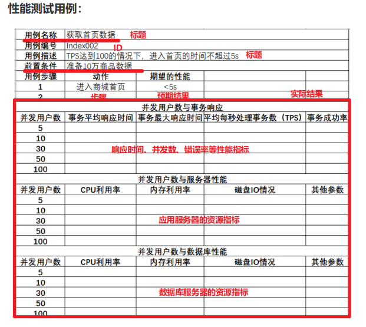

### 性能测试的理论

#### 性能测试的概念

- 性能测试概念：使用自动化工具，模拟不同的场景，对软件各项性能指标进行测试和评估的过程

- 性能测试：验证软件系统是否满足业务需求场景，主要焦点是业务场景的满足(**时间**、**资源**)
  - 时间: 系统处理用户请求的响应时间
  - 资源: 系统运行过程中，系统资源的消耗情况
- 性能测试的目的
  - 评估当前系统能力
  - 寻找性能瓶颈，优化性能
  - 评估软件是否能够满足未来的需要
- 性能测试和功能测试
  - 功能测试:验证系统的功能需求规格。焦点:功能(正向、逆向)
  - 性能测试:验证系统的业务需求场景。焦点:时间、资源
- 功能测试和性能测试有什么关系
  - 一般项目中，先功能测试通过后，后进行性能测试

#### 性能测试的策略

- 负载测试:`逐步增加负载，找到满足系统性能指标情况下的系统最大负载量`
  - 系统*最大负载量达到用户要求时*，系统才能正式上线使用。
- 稳定性测试:`在服务器稳定运行(用户正常的业务负载下)的情况下进行长时间测试(1天-1周等)，并最终保证服务器能满足线上业务需求`
- 压力测试:`高负载下，查看系统在峰值情况下的容错能力和可恢复能力`
  - `极限负载`情况下的破坏性压力测试
  - `高负载下`的长时间的稳定性压力测试
- 并发测试:`极短的时间内，发送大量请求，验证并发处理能力`
  - 特定活动场景，如：抢红包、秒杀、抢购等

#### 性能测试的指标

- 响应时间
  - 说明：响应时间指用户从客户端发起一个请求开始，到客户端接收到从服务器端返回的结果，整个过程所耗费的时间。
  - 组成：`响应时间 = 网络时间 + 应用程序处理时间`
- 并发数 ：同一时间向服务器发送请求的用户数
- 吞吐量 ：指的是**单位时间内**处理的客户端**请求数量**,直接体现软件系统的性能承载能力

  - TPS`每秒事务/业务数` ---- `一个事务可以对应一个请求/多个请求`
    - 计算：TPS = 并发数/平均响应时间
  - QPS:`每秒查询数`
  - 一个业务对应一个请求时： TPS = QPS
  - 一个业务对应 n 个请求时： QPS = n \* TPS

- 点击数： 所有的页面元素(如:图片、链接、框架等)的请求总数量
- 错误率： 指系统在负载情况下，失败业务的概率
  - 错误率是性能指标，是高负载下的失败业务的概率
  - 随机 bug 是功能 bug，先解决随机 bug 才能进行性能测试
- 资源利用率
  - 系统各种资源的使用情况，**资源的使用量/总的资源可用量 x100%**
  - 常见资源指标有哪些
    - CPU 使用率:不高于 75%-85%
    - 内存(大小)使用率:不高于 80%
    - 磁盘 10(速率):不高于 90%
    - 网络(速率):不高于 80%

#### 性能测试的流程

- 性能测试需求分析： 熟悉需求，获取性能需求指标
- 性能测试计划及方案：测什么，谁来测、怎么测

  - 测试的目的和范围
  - 测试人员和分工
  - 测试时间安排
  - 测试的方法

- 性能测试用例设计：用来验证系统是否符合需求

  

- 性能测试执行： 建立测试环境、编写测试脚本、性能测试监控、执行测试脚本

  - 搭建性能环境
  - 编写性能测试脚本
  - 配置性能测试监控指标
  - 执行脚本

- 性能分析和调优：分析性能结果，针对性能 bug 调优
  - 测试人员负责针对性能的测试结果进行分析是否存在 bug，由开发人员进行问题分析和调优
  - 在性能测试的回归过程中，可能需要进行多轮
- 性能测试报告总结：测试结果总结
  - 性能测试的过程
  - 性能测试的缺陷分析和调优
  - 性能测试的结果
  - 经验总结

#### 测试工县 LoadRunner 和 JMeter

`项目日常性能测试JMeter足够用，出商业报告优先LoadRunner`
