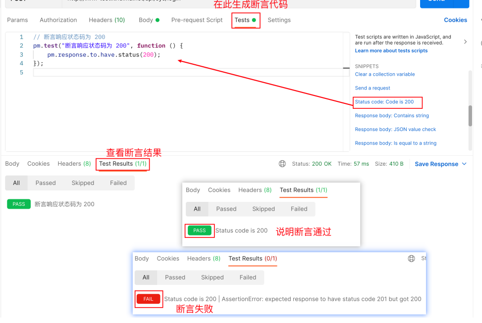

### 接口测试

#### 接口测试方式

- 工具
  - Postman
  - JMeter
- 代码
  - [python + Requests](https://github.com/DaisyXuYanRu/system_api_autotest)
  - java + HttpClient

#### Postman 高级用法

#### Potman 断言

- 让 Postman 工具 代替 人工 自动判断 预期结果 和 实际结果 是否一致
- 断言代码 书写在 Tests 标签页中。 查看断言结果 Test Results 标签页

1. 断言响应状态码

```js
// 断言响应状态码为 200
pm.test("Status code is 200", function () {
  pm.response.to.have.status(200);
});
/** 
pm：postman的实例。
test() postman实例的测试方法。 这个方法 有 2 个参数。
  参1："Status code is 200"。 这个参数可以任意修改，不影响 断言。
    作用：在断言结束后，显示给用户，断言结果的提示文字。
  参2：是一个 匿名函数 调用。
pm.response.to.have.status(200); 的意思是：
postman的响应结果中，应该有 响应状态码 200。 ———— 这里的 200 是 预期结果。
*/
```



2. 断言包含某字符串

```js
pm.test("Body matches string", function () {
  pm.expect(pm.response.text()).to.include("string_you_want_to_search");
});
/**
pm：postman的实例。
test() postman实例的测试方法。 这个方法 有 2 个参数。
参1："Body matches string"。 这个参数可以任意修改，不影响 断言。
作用：在断言结束后，显示给用户，断言结果的提示文字。
参2：是一个 匿名函数 调用。
pm.expect(pm.response.text()).to.include("string_you_want_to_search"); 的意思是：
postman 期望 响应文本中，应该包含 “你想搜索的字符串”(预期结果)
 */
```

3. 断言 JSON 数据

```js
pm.test("Your test name", function () {
  var jsonData = pm.response.json();
  pm.expect(jsonData.value).to.eql(100);
});
/**
pm：postman的实例。
test() postman实例的测试方法。 这个方法 有 2 个参数。
参1："Body matches string"。 这个参数可以任意修改，不影响 断言。
作用：在断言结束后，显示给用户，断言结果的提示文字。
参2：是一个 匿名函数 调用。
var jsonData = pm.response.json(); 将 整个 json响应体 赋值到 变量 jsonData 上。
pm.expect(jsonData.value).to.eql(100); postman 期望 json结果中 指定key 的值为 xxx
value 能取值：success、code、message
 */
```

#### Postman 关联

- 当接口和接口之间，有依赖关系时，需要借助 postman 关联技术，来实现。

`核心代码`

```js
// 1. 获取 响应数据，转为 json格式，保存到变量 jsonData中。
var jsonData = pm.response.json()
// 2.1 使用 全局变量做容器。
pm.globals.set("全局变量名", 全局变量值)
// 2.2 使用 环境变量做容器。
pm.environment.set("环境变量名", 环境变量值)
// 3. 在 postman 界面中（URL、请求头headers、请求体body） 提取 全局、环境变量 数据。
{{全局变量名}}/{{环境变量名}}
```

- 全局变量：在 整个 postman 中都可以使用的变量。不需要 单独创建环境。
- 环境变量：在 特定的环境下，才能使用的变量。需要给此变量创建单独的环境。(需要先在 Postman 的 Environments 中创建相应的环境)

#### Postman 参数化

- 什么是参数化：将 测试数据，组织到 数据文件中，通过脚本的反复迭代，使用不同的数据，达到测试不同用例的目标。
- 应用场景：一般在测试同一个接口的不同 测试点时，只有测试数据不同。考虑使用 参数化。

##### 数据文件

`编写方式`：记事本 -> 另存为 编码需要选择 UTF-8

- CSV：
  - 优点：数据组织格式简单
  - 缺点：
    1. 不能测试 bool 类型。因为 postman 读取 csv 后，将所有非数值类型数据，自动添加 "" 变为字符串
    2. 不能存储复杂数据类型（元组、列表、字典）。
    3. 不能实现 参数测试。
  - 应用场景：数据量较大，数据组织格式简单。

```text
username,password,msg
13012345678，123456,登录成功
13012345678,error,密码错误
13088889999，123456,账导不存在
```

- JSON：
  `编写方式`：https://www.bejson.com/ 等相关网站
- 优点：
  1. 可以测试 bool 类型
  2. 能使用 复杂数据类型
  3. 可以实现 参数测试。
- 缺点：相同数据量，json 文件要远大于 csv 文件。
- 应用场景：数据量较少，数据组织格式复杂。需要进行 参数测试！

##### 导入数据文件到 postman

- Runner
- 菜单 -> view -> show postman console

#### Postman 测试报告

- 安装 node.js 建议 nvm 管理 安装。具体 DeepSeek
- 安装 newman

```shell
# 安装newman
npm install -g newman
# 测试安装成功
newman -v
# 安装newman插件 - 扩展版
npm install -g newman-reporter-htmlextra
```

- 导出用例集
- 导出环境文件
- newman 生成测试报告

```shell
# 完整命令
newman run 用例集文件.json -e 环境文件.json -d 数据文件.(json或者.csv) -r htmlextra --reporterhtmlextra-export 测试报告名.html
# -e 和 -d 是 非必须的。
# 如果没有使用 环境，不需要指定 -e
# 如果没有使用 数据文件（做参数化），不需要指定 -d
```
